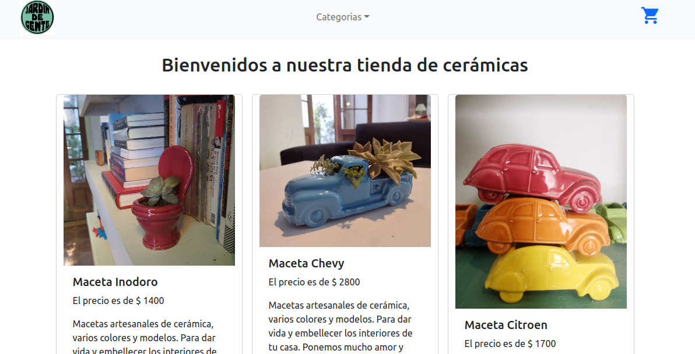

# Ecomerce creado con React 

El proyecto es una representación de un ecomerce para propósitos educativos, que simula la carga de productos desde un backend (provisto por Firebase), añade los productos a un carrito y finaliza la compra a través de un formulario, dándole finalmente los datos de la compra al usuario.



## Librerías utilizadas

-React Router Dom
-React Boostrap
-Firebase

### Pasos para levantar el pryecto localmente

```git clone https://github.com/pcosin/React-Productos-Cosin-Coder.git```

`npm install`

`npm start`


### Link público al proyecto 

```https://react-productos-cosin-coder.vercel.app/```

